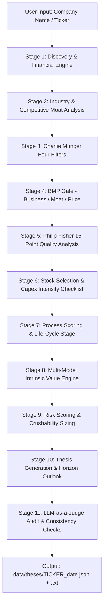

# Atlas — Autonomous Equity Research & Valuation Agent

**Atlas** is an autonomous, multi-agent equity research and valuation system designed for long-term, high-conviction fundamental investors. It evaluates public companies across multi-stage qualitative, quantitative, valuation, and risk frameworks—producing an institutional-grade investment thesis, intrinsic value estimate, and position sizing recommendation.

Built on the philosophies of **Warren Buffett**, **Charlie Munger**, **Philip Fisher**, **Peter Lynch**, **Mohnish Pabrai**, **Brian Feroldi**, and **Adam Seessel** (*Where the Money Is: Value Investing in the Digital Age*).

---

## Quick Start

```bash
# Clone the repository
git clone https://github.com/Shanal1988/atlas-agent.git
cd atlas-agent

# Install dependencies
pip install -r requirements.txt

# Run research on any global company or ticker
python main.py "Alphabet"
python main.py "Adyen"
python main.py "CrowdStrike"
python main.py "Berkshire Hathaway"
```

Atlas orchestrates the complete analysis, streams progress and intermediate verdicts to the terminal, and saves structured thesis reports to `data/theses/` in both formatted text (`.txt`) and machine-readable (`.json`) formats.

---

## System Architecture & Analytical Pipeline



### Analytical Stages

| Stage | Module | Methodology & Description |
|-------|--------|---------------------------|
| **1. Discovery & Financials** | `agents/discovery.py` | Resolves ticker with search fallback. Extracts financials from FMP and Yahoo Finance. Derives **Enterprise Value ($EV$)**, net cash balances, corporate cash (net of customer settlement float), and historical revenue CAGR. |
| **2. Industry & Competitors** | `agents/industry.py` | Analyzes industry dynamics, TAM, oligopoly structures, competitive positioning, peer group metrics, and structural moat defensibility. |
| **3. Munger Four Filters** | `agents/munger.py` | Evaluates Charlie Munger's mental model: **F1** Business Understandability, **F2** Sustainable Moat, **F3** Trustworthy & Able Management, **F4** Price with Margin of Safety. |
| **4. BMP Gate** | `agents/bmp_gate.py` | 5-question fundamental gate: **Q1** Runway/TAM, **Q2** Pricing Power & Moat, **Q3** FCF Generation, **Q4** Reinvestment Engine, **Q5** Price Sanity (Adam Seessel EV Normalized OEY). |
| **5. Fisher 15 Points** | `agents/fisher.py` | Philip Fisher's *Common Stocks and Uncommon Profits* framework (15 points). Features targeted deep-search for sales organization strength, R&D efficacy, labor relations, and executive depth. |
| **6. Stock Selection** | `agents/stock_selection.py` | 8-question quality checklist including Buffett $1 Test, Net Debt / FCF, ROE consistency, and **Maintenance vs. Growth Capex intensity separation**. |
| **7. Process Scoring** | `agents/process_scoring.py` | **Ten Vital Signs**, **Feroldi Quality Score Screen** (Qualitative, Quantitative, Valuation rank score), **Investment Lifecycle Stage (1–10)**, and **Peter Lynch Classification** (Stalwart, Fast Grower, etc.). |
| **8. Intrinsic Value Engine** | `agents/valuation.py` | Triangulates valuation across four classical models: **Dhandho Low-Risk / High-Uncertainty**, **Benjamin Graham Formula**, **3-Stage Discounted Cash Flow (DCF)**, and **Expected Returns**. |
| **9. Risk Scoring & Sizing** | `agents/risk_scoring.py` | **Diamond-to-Egg Crushability framework** (Glass Bottle, Wood Box, Steel Safe, Diamond Safe). Evaluates 16 qualitative risk factors with an automated **Negative Justification Audit**, dynamic growth hurdles, and stage caps. |
| **10. Thesis & Outlook** | `agents/thesis_writer.py` | Generates institutional thesis: Executive Summary, Bull/Bear balance, Watch Points, 2-3 Year Catalysts, 5-Year Milestones, 10-Year Destination, and deterministic guardrail decisions (`INVEST`, `WATCHLIST`, `PASS`). |
| **11. LLM-as-a-Judge** | `agents/judge.py` | Independent verification layer that audits score justifications, checks bull/bear factual balance, flags speculative claims, and verifies cross-stage consistency. |

---

## Core Methodologies & Innovations

### 1. Digital Value Investing: Adam Seessel OEY Framework
Traditional GAAP penalizes digital companies by forcing immediate expensing of intangible investments (AI research, software engineering, customer acquisition S&M) through operating expenses rather than capitalizing them. Atlas implements Adam Seessel's framework (*Where the Money Is*):

- **Enterprise Value Basis**: Denominator prefers Enterprise Value ($EV = \text{Market Cap} + \text{Debt} - \text{Cash}$) to reward cash-rich balance sheets and penalize levered capital structures.
- **Normalized Steady-State EBIT**: Normalizes digital margins for leaders reinvesting heavy growth OpEx (e.g. Google blended search/cloud at ~38.4%, Meta at ~48.5%, Amazon blended retail/AWS/ads at ~15.3%, SaaS baselines at 32–36%).
- **Dynamic Growth-Adjusted Hurdle Rate**:
  - **Elite Compounders** ($\text{CAGR} \ge 12\%$ or $\text{ROE} \ge 20\%$): Normalized OEY hurdle of **$\ge 3.5\%$** ($<28.5\times$ EV/NOPAT) qualifies as attractive entry.
  - **Mature Businesses**: Standard **$\ge 5.0\%$** value hurdle is enforced.

### 2. Capex Separation: Maintenance vs. Growth
Atlas differentiates between capital required to defend existing operations (**Maintenance Capex**) and discretionary capital deployed to expand capacity or build new business lines (**Growth Capex**). If disclosures do not report maintenance capex directly, Atlas models industry-standard depreciation/amortization ratios to ensure high-reinvestment compounders are not penalized as capital-intensive.

### 3. Diamond-to-Egg Risk & Sizing Framework

Position sizing is governed by the total count of NO / UNKNOWN risk factors and qualitative vulnerabilities:

| Crushability Category | Risk NOs | Maximum Allocation | Portfolio Action |
|-----------------------|----------|-------------------|------------------|
| **Diamond Safe**      | 0 – 5    | 6.0% – 10.0%      | Core high-conviction holding |
| **Steel Safe**        | 6 – 8    | 4.0% – 6.0%       | Standard core allocation |
| **Wood Box**          | 9 – 11   | 2.0% – 4.0%       | Moderate position size |
| **Cardboard Box**     | 12 – 14  | 1.0% – 2.0%       | Small speculative allocation |
| **Glass Bottle**      | 15 – 18  | 0.0% – 1.0%       | Extreme fragility; price veto triggered |
| **Egg Shell**         | 19+      | 0.0%              | Uninvestable — capital preservation priority |

---

## Setup & Configuration

### 1. Environment Variables

Create a `.env` file in the root directory:

```env
# Primary Financial Data & Web Search
FMP_API_KEY=your_fmp_api_key
TAVILY_API_KEY=your_tavily_api_key

# Multi-Tier LLM Providers (Automatic Failover)
GROQ_API_KEY=your_groq_api_key
GEMINI_API_KEY=your_gemini_api_key
OPENROUTER_API_KEY=your_openrouter_api_key

# Optional Model Overrides
GROQ_MODEL=openai/gpt-oss-120b
GEMINI_MODEL=gemini-3.6-flash
OPENROUTER_MODEL=deepseek/deepseek-r1-0528:free
```

### 2. Multi-Provider LLM Resilience
Atlas features an automated multi-provider failover system (`agents/llm_client.py`). If a provider hits rate limits (HTTP 429) or is unavailable, Atlas cycles through Groq, Gemini, and OpenRouter models with automated reasoning token (`<think>...</think>`) sanitization.

---

## Evaluation & Regression Testing

Atlas includes a full evaluation suite located in `evals/`:

```bash
# Run prompt regression suite on benchmark companies
python evals/regression_suite.py

# Check scoring consistency and variance across N runs
python evals/consistency_eval.py --ticker GOOGL --runs 5

# Audit parser coverage and fallback rates across saved theses
python evals/parser_coverage_eval.py

# Backtest performance of historical thesis recommendations
python evals/backtest.py
```

---

## Project Structure

```
atlas-agent/
├── main.py                      # CLI entry point and pipeline orchestrator
├── agents/
│   ├── context.py               # Shared profile serialization & Adam Seessel OEY engine
│   ├── discovery.py             # Financial data ingestion (FMP + yfinance) & EV extraction
│   ├── industry.py              # Industry dynamics, TAM, and peer group analysis
│   ├── munger.py                # Charlie Munger Four Filters gate
│   ├── bmp_gate.py              # Business / Moat / Price (BMP) gate
│   ├── fisher.py                # Philip Fisher 15-point quality checklist
│   ├── stock_selection.py       # Stock selection checklist & Maintenance Capex engine
│   ├── process_scoring.py       # Vital Signs, Quality Screen, Lifecycle Stage, Lynch
│   ├── valuation.py             # Multi-model Intrinsic Value engine (Dhandho, Graham, DCF)
│   ├── risk_scoring.py          # Diamond-to-Egg risk assessment & position sizing
│   ├── thesis_writer.py         # Institutional investment thesis & horizon outlook
│   ├── judge.py                 # LLM-as-a-Judge audits & consistency validation
│   ├── llm_client.py            # Multi-provider LLM failover client with think-tag cleaner
│   ├── fmp_client.py            # Financial Modeling Prep API wrapper with retry logic
│   └── web_search.py            # Search provider with multi-engine fallback
├── data/
│   └── theses/                  # Generated thesis artifacts (.json and .txt)
├── evals/                       # Automated test suites and consistency evals
├── requirements.txt             # Project dependencies
└── README.md                    # Project documentation
```

---

## Disclaimer

**Not Financial Advice.** Atlas is an automated investment research tool built for educational, analytical, and workflow demonstration purposes. All financial estimates, intrinsic value ranges, and scoring verdicts are generated algorithmically and should be independently verified before making investment decisions.
